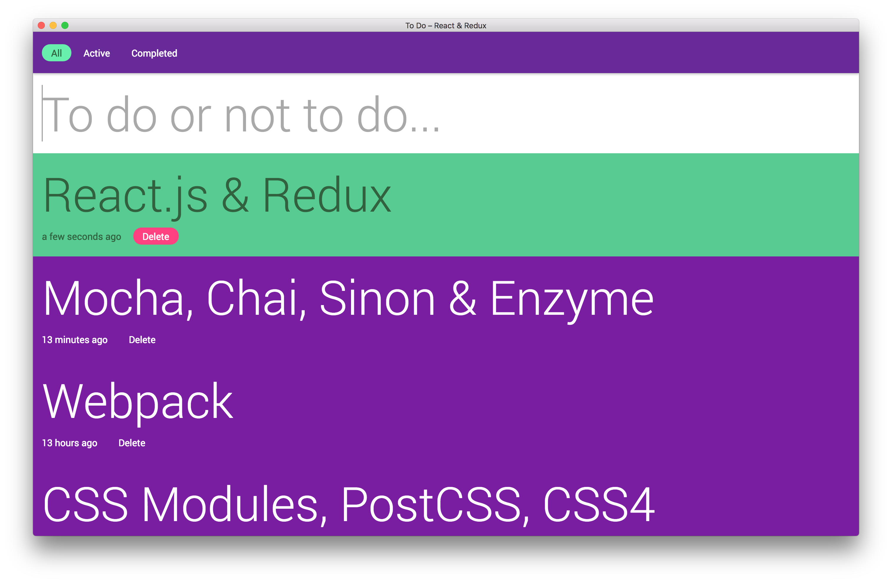

# react-redux-todo
[](https://travis-ci.com/mathewhawley/react-redux-todo)

This is a simple, classic 'to do' application that has been built as a learning exercise – to act as an introduction to various technologies and practices that I am keen to explore and potentially work more with going forward.



## The stack
A lot of these are firsts for me – most notably Redux, PostCSS, ESLint and unit testing.

* [React](https://facebook.github.io/react/)
* [Redux](http://redux.js.org/)
* [Webpack](https://webpack.github.io/)
* [CSS Modules](https://github.com/css-modules/css-modules)
* [PostCSS](http://postcss.org/)
* [Babel](https://babeljs.io/)
* [Mocha](https://mochajs.org/), [Chai](http://chaijs.com/), [Sinon](http://sinonjs.org/) and [Enzyme](http://airbnb.io/enzyme/)
* [Node.js](https://nodejs.org/en/)
* [ESLint](http://eslint.org/)
* [Stylelint](http://stylelint.io/)

## Set up
Currently, this build is only configured for a development environment. Future steps will look to add a production build and server-side rendering.

To run this application, please make sure you are using at least `v5.0.0` of **Node.js**.

Once you have cloned the repository, simply run:

```
$ npm install
$ npm run dev
```

Then open your browser and go to `http://localhost:8080`.